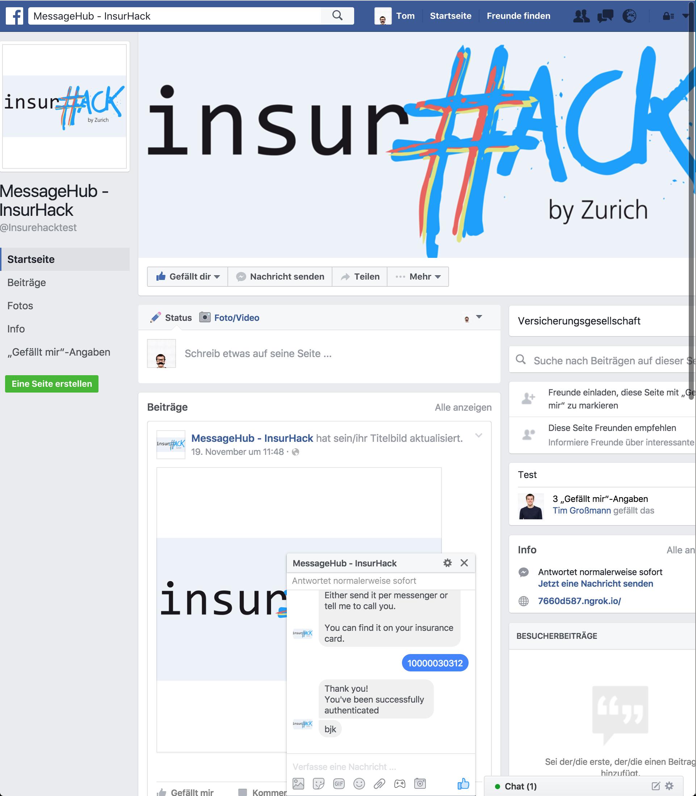
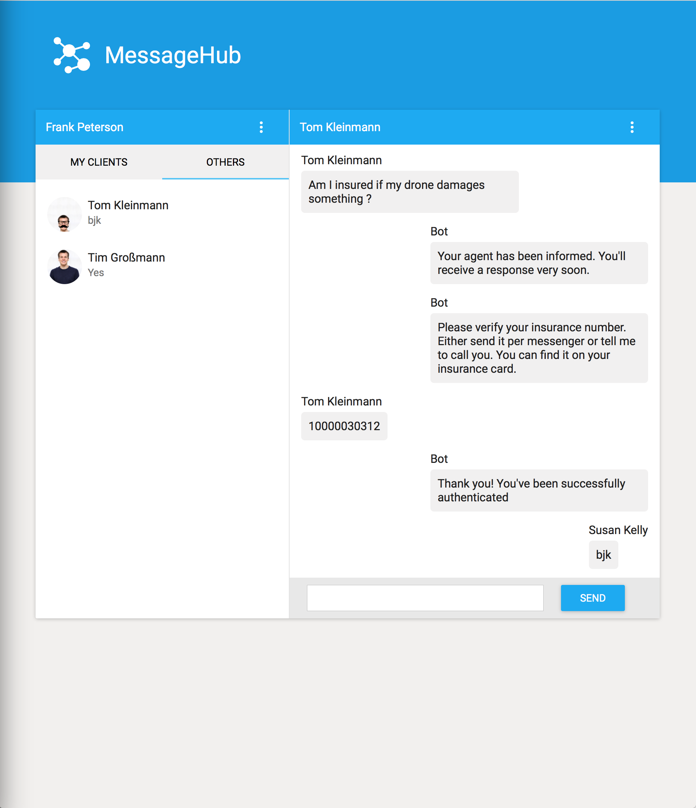
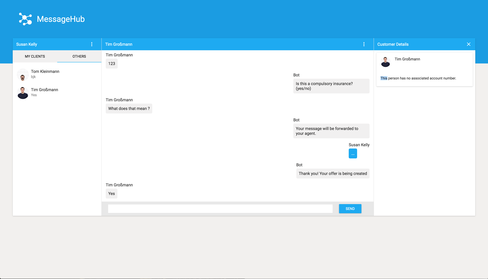

 
# Insure Hack
#### Ask insurance related questions and get professional answers from real insurance agents

> This was created on the Zurich InsurHack in Cologne

> The facebook app only forwards developer/admin requests, therefore you won't get any answer
> from the MessageHub page when writing it a message...

### Inspiration
Over the time, communication changes. Instant messaging is one of the most used tools for communication but the lack of personal contact leads to great obstacles for serious use cases like for example insurance.
If i talk about my insurance, i don't want to get answers from a chatbot, i want a real person, a real insurance agent to give me professional answers.  
These agents won't only have 1 client to handle, so they need a better platform to keep the overview. Something simpler than the Facebook messenger where they can see all of their clients and get notified if they have a question or want to chat about a new contract.  
That's where MessageHub steps into action!

### What we build 
We created a platform (MessageHub) where insurance agents can easily manage their assigned clients and answer their questions. The messages from facebook will be forwarded to our MessageHub platform where the agents can start several automatet processes (e.g. user-authentication / pre-defined forms) and also answer questions directly.  
The answers will be sent to the clients messenger, where they can use their favorite tool of communication (instant messaging) to finally get information about their insurance. 

For customers, the agents can easily view the current state of insurance in a detail view to instantly be informed.


### Built With
Javascript, HTML, CSS, React, Express, Node.js, Facebook Message API, Zurich GI API

### Screenshots


- This is the FB Page of the MessageHub, here anyone can ask questions / Small MessageHub desktop view, with no details of the customer displayed  


- Details of the customer would appear on the right column


### Check out the GUI
```bash
npm start
```
